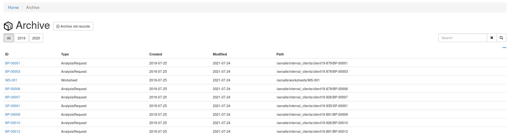

Quickstart
==========

This section gives an introduction about `senaite.archive`_. It assumes you
have `SENAITE LIMS`_ and ``senaite.archive`` already installed. Please read the
:doc:`installation` for further details.

.. _ArchiveSettings:

Control panel
-------------

Visit the control panel view for senaite.archive to configure the settings. This
control panel is accessible to users with `Site Administrator` role, through
"Site Setup" view, "Add-on Coniguration" section:

http://localhost:8080/senaite/@@archive-controlpanel

From this control panel view you can define the following settings:

* *Retention period* *: the number of years you want to retain data for.
  Default: 2 (years).

* *Date criteria* *: the date criteria used to check whether an electronic
  record is outside of the retention period. For instance, if the value is
  ``created``, the system will consider for archival those non active records
  that were created before the retention period. Default: 'created'

* *Archive path* *: the full path of the local directory where archived
  objects will be stored. User that runs the instance must have write access.
  The XML objects extracted from the system will be stored in this path,
  organized in a tree structure as follows: the top level directory represents
  the year when the objects where created and the directory below represents
  the week number within the year when the objects were created.

Archiving objects
-----------------

Login as a SENAITE regular user with enough privileges to archive samples.
Go to samples listing, click to the "Published", "Cancelled" or "Invalid"
statuses. Select the oldest sample that is outside of the retention period
you've defined in the Archive settings (see previous section). A button
"Archive" is displayed at the bottom of the list.

Same principle applies for Worksheets and Batches listings.

Although the archiving of individual objects is possible, the recommended
approach is to archive all objects that are outside of the retention period
automatically without the need of selecting them manually. Visit the "Archive"
link at the left and press the button "Archive old records".

The archived items will eventually be displayed in the archive items listing.
Archived items are also searchable for historic purposes.

.. Links

.. _SENAITE LIMS: https://www.senaite.com
.. _senaite.archive: https://pypi.org/senaite.archive
